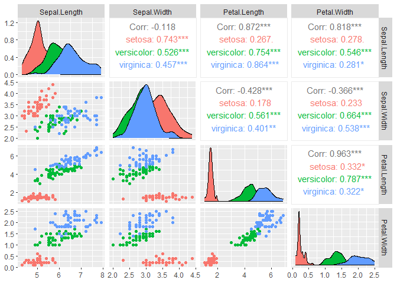

Iris Classification
================
Harmanpreet6351
2022-11-28

# Iris Classification

## Loading required Libraries

### About Data set

We are using Iris data set which comes with R dataset library

Viewing first 6 rows of data set

``` r
head(iris)
```

    ##   Sepal.Length Sepal.Width Petal.Length Petal.Width Species
    ## 1          5.1         3.5          1.4         0.2  setosa
    ## 2          4.9         3.0          1.4         0.2  setosa
    ## 3          4.7         3.2          1.3         0.2  setosa
    ## 4          4.6         3.1          1.5         0.2  setosa
    ## 5          5.0         3.6          1.4         0.2  setosa
    ## 6          5.4         3.9          1.7         0.4  setosa

Summarizing data

``` r
summary(iris)
```

    ##   Sepal.Length    Sepal.Width     Petal.Length    Petal.Width   
    ##  Min.   :4.300   Min.   :2.000   Min.   :1.000   Min.   :0.100  
    ##  1st Qu.:5.100   1st Qu.:2.800   1st Qu.:1.600   1st Qu.:0.300  
    ##  Median :5.800   Median :3.000   Median :4.350   Median :1.300  
    ##  Mean   :5.843   Mean   :3.057   Mean   :3.758   Mean   :1.199  
    ##  3rd Qu.:6.400   3rd Qu.:3.300   3rd Qu.:5.100   3rd Qu.:1.800  
    ##  Max.   :7.900   Max.   :4.400   Max.   :6.900   Max.   :2.500  
    ##        Species  
    ##  setosa    :50  
    ##  versicolor:50  
    ##  virginica :50  
    ##                 
    ##                 
    ## 

Visualizing

``` r
ggpairs(iris[-5], mapping = aes(colour=iris$Species), progress = F)
```

<!-- -->

### Splitting Dataset into train and test

``` r
samp <- sample(nrow(iris), 0.75*nrow(iris))
train <- iris[samp,]
test <- iris[-samp,]
```

First 6 rows of Train data set

``` r
head(train)
```

    ##     Sepal.Length Sepal.Width Petal.Length Petal.Width    Species
    ## 150          5.9         3.0          5.1         1.8  virginica
    ## 115          5.8         2.8          5.1         2.4  virginica
    ## 38           4.9         3.6          1.4         0.1     setosa
    ## 5            5.0         3.6          1.4         0.2     setosa
    ## 27           5.0         3.4          1.6         0.4     setosa
    ## 63           6.0         2.2          4.0         1.0 versicolor

First 6 rows of Test data set

``` r
head(test)
```

    ##    Sepal.Length Sepal.Width Petal.Length Petal.Width Species
    ## 6           5.4         3.9          1.7         0.4  setosa
    ## 13          4.8         3.0          1.4         0.1  setosa
    ## 16          5.7         4.4          1.5         0.4  setosa
    ## 21          5.4         3.4          1.7         0.2  setosa
    ## 22          5.1         3.7          1.5         0.4  setosa
    ## 24          5.1         3.3          1.7         0.5  setosa

### Training model using Support Vector Machine

``` r
model1 <- svm(Species ~ ., data = train)
pred1 <- predict(model1, test[-5])
confusionMatrix(pred1, test$Species)
```

    ## Confusion Matrix and Statistics
    ## 
    ##             Reference
    ## Prediction   setosa versicolor virginica
    ##   setosa          9          0         0
    ##   versicolor      0         13         1
    ##   virginica       0          0        15
    ## 
    ## Overall Statistics
    ##                                           
    ##                Accuracy : 0.9737          
    ##                  95% CI : (0.8619, 0.9993)
    ##     No Information Rate : 0.4211          
    ##     P-Value [Acc > NIR] : 2.826e-13       
    ##                                           
    ##                   Kappa : 0.9596          
    ##                                           
    ##  Mcnemar's Test P-Value : NA              
    ## 
    ## Statistics by Class:
    ## 
    ##                      Class: setosa Class: versicolor Class: virginica
    ## Sensitivity                 1.0000            1.0000           0.9375
    ## Specificity                 1.0000            0.9600           1.0000
    ## Pos Pred Value              1.0000            0.9286           1.0000
    ## Neg Pred Value              1.0000            1.0000           0.9565
    ## Prevalence                  0.2368            0.3421           0.4211
    ## Detection Rate              0.2368            0.3421           0.3947
    ## Detection Prevalence        0.2368            0.3684           0.3947
    ## Balanced Accuracy           1.0000            0.9800           0.9688

### Training with Support Vector machine but only with Petal Length and Petal Width

``` r
model2 <- svm(Species ~ Petal.Length + Petal.Width, data = train)
pred2 <- predict(model2, test[c(3,4)])
confusionMatrix(pred2, test$Species)
```

    ## Confusion Matrix and Statistics
    ## 
    ##             Reference
    ## Prediction   setosa versicolor virginica
    ##   setosa          9          0         0
    ##   versicolor      0         13         1
    ##   virginica       0          0        15
    ## 
    ## Overall Statistics
    ##                                           
    ##                Accuracy : 0.9737          
    ##                  95% CI : (0.8619, 0.9993)
    ##     No Information Rate : 0.4211          
    ##     P-Value [Acc > NIR] : 2.826e-13       
    ##                                           
    ##                   Kappa : 0.9596          
    ##                                           
    ##  Mcnemar's Test P-Value : NA              
    ## 
    ## Statistics by Class:
    ## 
    ##                      Class: setosa Class: versicolor Class: virginica
    ## Sensitivity                 1.0000            1.0000           0.9375
    ## Specificity                 1.0000            0.9600           1.0000
    ## Pos Pred Value              1.0000            0.9286           1.0000
    ## Neg Pred Value              1.0000            1.0000           0.9565
    ## Prevalence                  0.2368            0.3421           0.4211
    ## Detection Rate              0.2368            0.3421           0.3947
    ## Detection Prevalence        0.2368            0.3684           0.3947
    ## Balanced Accuracy           1.0000            0.9800           0.9688

## A similar accuracy is achieved. Why?

From above analysis, it can been seen that petal length and petal width
have high correlation and there we get a similar accuracy. Therefore, it
can be concluded that **Petal Length and Petal Width are important
features** as compared to Sepal Length and Sepal Width.

# Thank you.
